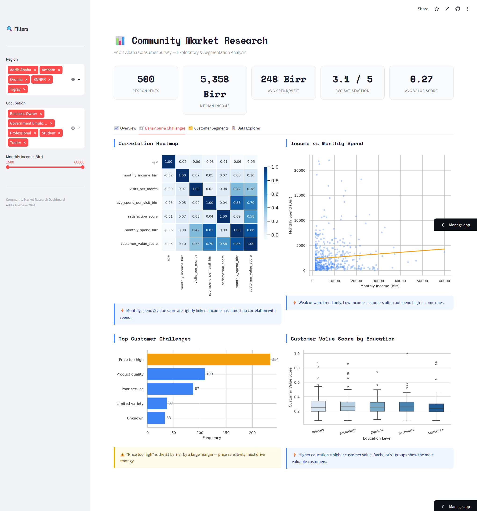

# Community Market Research Dashboard

> An end-to-end data analysis project — survey data cleaning, exploratory analysis, customer segmentation, and an interactive Streamlit dashboard.

**Live demo → [community-market-research.streamlit.app](https://community-market-research.streamlit.app/)**

---

## What This Project Does

This project analyses a 500-respondent consumer survey from Ethiopia. It answers three business questions:

1. **Who are our customers?** — Demographics, income bands, region, and education
2. **How do they behave?** — Spend habits, visit frequency, preferred channels and categories
3. **Which customers are most valuable?** — K-Means segmentation to group customers by behaviour, not just income

---

## Dashboard Preview



|Overview|Behaviour & Challenges|
|---|---|
|KPI cards, region breakdown, income distribution, spend by occupation|Correlation heatmap, top challenges, value by education|

|Customer Segments|Data Explorer|
|---|---|
|Auto K-Means clustering, elbow/silhouette charts, cluster profiles|Filterable table, summary stats, CSV download|

> Sidebar filters (Region, Occupation, Income range) update every chart and table live.

---

## Key Findings

- **Income is not the right segmentation axis.** Low-income customers frequently outspend high-income ones. Behavioural signals (visit frequency × spend per visit) predict customer value far better than income.
- **"Price too high" is the #1 customer barrier** — by a large margin. Any pricing or promotion strategy must address this first.
- **Most customers are neutral (score 3/5).** A meaningful minority score 1–2, representing real churn risk that needs attention.
- **Education predicts value.** Bachelor's degree holders and above cluster into the highest-value segments (confirmed statistically via ANOVA).
- **Physical shop dominates (≈50% of channel share).** Digital channels are small but present — an untapped growth opportunity.
- **The sample is geographically skewed toward Addis Ababa.** Regional conclusions beyond Addis should be treated with caution.

---

## Project Structure

```
community-market-research-dashboard/
├── .github/workflows/
│   └── ci.yml                  # CI pipeline
├── app/
│   └── app.py                  # Streamlit dashboard (4 tabs, live filters)
├── dashboard/  
│ ├── Overview_Dashboard.png  
│ ├── Customer_Segments.png  
│ ├── Behaviour_and_Challenges.png  
│ └── Data_Explorer.png      # Screenshots of the working Streamlit dashboard
├── charts/                    
│   ├── 01_respondents_by_region.png
│   ├── 02_income_distribution.png    # 13 charts generated during EDA and clustering
│        |
         |
├── data/
│   ├── raw/
│   │   └── survey.csv          # Original survey data (500 rows)
│   └── processed/
│       └── survey_cleaned.csv  # Cleaned + feature-engineered output
├── notebooks/
│   ├── 01_cleaning.ipynb       # Data cleaning pipeline
│   ├── 02_eda.ipynb            # Exploratory data analysis (12 charts)
│   └── 03_clustering.ipynb     # K-Means customer segmentation
├── requirements.txt
└── README.md
```

---

## How to Run Locally

### 1. Clone the repo

```bash
git clone https://github.com/<your-username>/community-market-research-dashboard.git
cd community-market-research-dashboard
```

### 2. Set up the environment

```bash
python -m venv venv

# Windows
venv\Scripts\activate

# macOS / Linux
source venv/bin/activate

pip install -r requirements.txt
```

### 3. Run the Streamlit app

```bash
streamlit run app/app.py
```

The app opens at `http://localhost:8501`.

> **No data?** If `data/processed/survey_cleaned.csv` is not present, the app automatically generates synthetic demo data so you can still explore all features.

---

## Run the Notebooks

Open Jupyter and run the notebooks in order:

```bash
jupyter notebook
```

|Notebook|What it does|
|---|---|
|`01_cleaning.ipynb`|Loads raw CSV, handles nulls, standardises text columns, engineers `monthly_spend_birr` and `customer_value_score`, saves cleaned data|
|`02_eda.ipynb`|Produces 12 charts covering demographics, spend behaviour, channels, satisfaction, and correlations; runs ANOVA on education vs value|
|`03_clustering.ipynb`|Scales features, runs K-Means for K=2–8, selects best K by silhouette score, outputs cluster profiles and scatter plot|

---

## Feature Engineering

Two derived columns are created in `01_cleaning.ipynb` and used throughout:

|Column|Formula|Purpose|
|---|---|---|
|`monthly_spend_birr`|`visits_per_month × avg_spend_per_visit_birr`|Total monthly spend estimate|
|`customer_value_score`|`0.7 × spend_norm + 0.3 × sat_norm`|Composite value metric combining spend and satisfaction|

---

## App Features

### Sidebar Filters

Three filters — **Region**, **Occupation**, and **Income range** — apply to every chart and table in real time.

### Tab: Overview

Respondents by region · Income distribution · Average spend by occupation · Preferred product categories · Purchase channel pie · Satisfaction score distribution

### Tab: Behaviour & Challenges

Correlation heatmap across all numeric features · Income vs monthly spend scatter with regression line · Top customer challenges frequency · Customer value score by education level (boxplot)

### Tab: Customer Segments

Automatic K-Means clustering (K=2–8) · Elbow and silhouette charts to select best K · Cluster profile table (averages for age, income, visits, spend, satisfaction, value) · Income vs spend scatter coloured by segment · Modal region / occupation / product category per segment

### Tab: Data Explorer

Filterable dataset view · Numeric summary statistics · One-click CSV download of the filtered data

---

## Tech Stack

|Layer|Tools|
|---|---|
|Language|Python 3.13|
|Data|pandas, numpy|
|Visualisation|matplotlib, seaborn|
|Machine learning|scikit-learn (KMeans, StandardScaler, silhouette_score)|
|Dashboard|Streamlit|
|Environment|venv|
|CI|GitHub Actions|

---

## Requirements

```
streamlit
pandas
numpy
matplotlib
seaborn
scikit-learn
```

Install with:

```bash
pip install -r requirements.txt
```

---

## Author

Built by **** as a portfolio project demonstrating end-to-end data analysis — from raw survey data to an interactive, deployable dashboard.

- GitHub: [github.com/Betelem401](https://github.com/Betelhem401)
- LinkedIn: [linkedin.com/in/betelhemhailuk](https://www.linkedin.com/in/betelhemhailuk/?skipRedirect=true)
